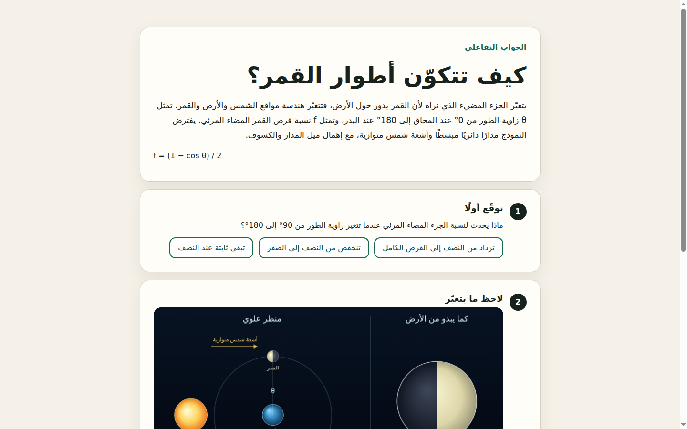
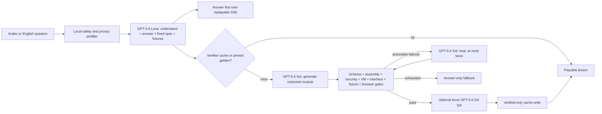

<div align="center">

# Laysh — ليش

### اسأل ليش، والعب الجواب · Ask why. Play the answer.

An Arabic-first learning experience that answers a learner's question, then builds a
small verified simulation for prediction, observation, and explanation.

**Live demo:** `https://<FINAL-DEMO-URL>` **(owner placeholder; replace before submission)**  
**Public repository:** `https://<FINAL-REPOSITORY-URL>` **(owner placeholder; replace after push)**



</div>

## Why Laysh

Arabic-speaking secondary-school learners often find a correct explanation but still
cannot *see* the causal relationship. Laysh turns a short “why?” question into two useful
outcomes: an answer arrives first, then a focused interactive lesson when the concept is
safe and meaningfully simulatable. The core flow is designed for learners aged 13+ on a
phone and for teachers who want a downloadable lesson to project or share.

The six builder-reviewed lessons—Moon phases, buoyancy, pendulum period, a simple
circuit, sound pitch, and day/night—open instantly. A new question uses Codex to create
only the phenomenon-specific module; Laysh supplies the trusted, accessible lesson shell.

## Try it

The hosted demo will require no Laysh account or payment. Until the owner inserts the
final URL, the complete local judging path is:

```bash
git clone https://<FINAL-REPOSITORY-URL>/laysh.git
cd laysh
uv sync --frozen --extra dev
npm install
LAYSH_CODEX_BACKEND=mock .venv/bin/uvicorn server.app:create_app --factory --port 8765
```

Open <http://127.0.0.1:8765>, choose **أطوار القمر** for a quota-free instant path, move
the main control, inspect the causal text alternative and verification receipt, then use
the download action to open the network-dead HTML outside the hosting origin. The mock
backend exercises the full product without an OpenAI login or model spend. The owner-run
hosted service uses Codex for new questions.

## How it works



The generated JavaScript can implement only `window.LayshSimulation`. It never controls
the page shell, CSP, learner-facing controls, accessibility structure, or download
policy. Every changed candidate restarts deterministic verification from gate one.
Public SSE contains safe stages and gate names, not prompts, source, raw model output,
reasoning, paths, or traces.

## Verification receipts—not guarantees

Tier A identifies a builder-reviewed pinned lesson. Tier B identifies a live module that
passed the applicable machine gates. “Answer only” means no simulation was released.
Receipts report the effective model, elapsed time, deterministic check count, browser
outcome, and heal count from that run. They mean “these declared checks passed,” not that
Laysh has proved a scientific claim universally or replaced a teacher's review.

The portable artifact is a single HTML document with inline CSS, JavaScript, font, and
favicon; its CSP disables network connections, navigation, objects, and forms. The
parent iframe is sandboxed with scripts but without same-origin access.

## Supported coverage and honest limits

The reviewed P0 coverage is six narrow secondary-school concept models:

| Domain | Reviewed model | Important assumption |
|---|---|---|
| Earth and space | Moon phases; day/night | Schematic geometry; scale is explanatory, not astronomical |
| Mechanics | Buoyancy; small-angle pendulum | Still water; idealized pendulum and local gravity |
| Electricity | Resistance and bulb brightness | Simplified constant-voltage resistive circuit |
| Waves | Frequency and pitch | Simplified propagation; no audio is played |

New safe science questions can be attempted, but broad curriculum coverage is not
claimed. Laysh can decline unsafe, non-simulatable, ambiguous, or exhausted jobs and
preserve the answer. Generated models are simplified teaching models; assumptions and
units belong in the lesson. There are no accounts, learner histories, scores, analytics,
voice input, presenter mode, or 3D in P0.

Measured public-mode latency on two unseen smoke cases is above the product objective:

| Metric | Measured | P0 objective | Outcome |
|---|---:|---:|---|
| First useful answer, p95 | **25.3 s** | ≤12 s | Not met |
| New module, p95 | **178.3 s** | ≤90 s | Not met |
| Exact verified cache, p95 | see `out/benchmark.json` | ≤1 s | Met in G5 |
| Hard public terminal | 178.3 s max observed | ≤180 s | Met in G5 |

The two-sample live p95 is a nearest-rank release measurement, not a population-level
performance claim. The richer v1.1 golden set raised generate-stage p95 from 98.3 s to
155.9 s. That regression is accepted as an explicit quality trade-off, not hidden.

For the bounded v1.1 optimization pass, the representative rendered generation prompt was
trimmed from 5,285 to 4,164 characters (−21.2%) without removing the visual or safety bar.
The matched Arabic force–acceleration smoke generated in 63.7 s versus 58.0 s in v1.0
(+9.9%), emitted its first answer at 18.0 s, healed once, and completed in 159.7 s. This is
one matched observation, not a new p95 claim; the full measurements live in
`out/evidence/g7-latency.json`.

The Arabic UI says that a new experience may take up to three minutes. During that wait it
shows only real answer, stage, heartbeat, verification, and self-heal events. Instant
goldens remain the dependable fast path, while every public job retains its 180-second hard
terminal and every evidence build retains its 600-second budget.

## Quota protection

- Three new live generations per keyed IP hash per hour; no raw IP is retained.
- Sixty new live generations globally per UTC day.
- Two Codex jobs run concurrently and at most ten wait in the queue.
- Public jobs have a 180-second hard terminal budget and use `--ephemeral`.
- Gallery and cache playback consume no generation quota.
- Over-limit traffic receives a localized answer-only/gallery path, never a raw 429 page.
- Evidence mode is disabled by default and accepts only allowlisted repository fixtures.

These controls protect a competition demo, not a high-scale production deployment. The
limits are in-memory for P0 and reset on service restart.

## Safety and privacy

Questions on the live path are processed by OpenAI/Codex. Do not enter personal,
sensitive, or confidential information. Local prefilters stop obvious high-risk and
personal-identifier patterns before model spend; the list is deliberately not described
as comprehensive. Raw questions are cleared after a job and are not written to Laysh's
job evidence or cache. Public `--ephemeral` controls local Codex session persistence; it
does **not** make a claim about OpenAI's remote retention or training controls.

The release is for ages 13+. An under-13 launch is outside P0 and would require separate
legal, privacy, and consent work.

## How I collaborated with Codex

The builder authored the product direction and acceptance standard in the read-only
briefs `/home/dev/laysh-briefs/SPEC-V3.md`, `IMPLEMENTATION-PLAN.md`,
`ACCEPTANCE-MATRIX.md`, and `research-pedagogy.md`. Those briefs own the Arabic-first
product choice, answer-first pedagogy, predict → observe → explain sequence, restricted
module architecture, security posture, model-quality bar, visual direction, and release
trade-offs. The builder also reviewed every golden for scientific meaning, teaching flow,
Arabic wording, and mobile/desktop appearance.

Codex accelerated implementation inside one continuous primary build thread: it authored
the new repository, closed schemas, trusted simulation shell, FastAPI job/SSE flow,
runtime adapter, prompts, gate diagnostics, bounded heal loop, browser automation,
responsive interface, golden evidence, tests, deployment files, and release kit. The
builder repeatedly supplied concrete failure evidence and made the product, pedagogy,
engineering, and visual decisions; Codex converted those decisions into tested code and
granular commits.

GPT-5.6 also has a meaningful runtime role. The public path uses **gpt-5.6-luna** to
normalize Arabic/English intent and return the answer, fixed module specification, and
independent fixtures in one closed-schema call. **gpt-5.6-sol** generates the restricted
module, receives exact gate reports to heal a failed draft, and performs bounded terse QA
when required. No non-GPT-5.6 model exists anywhere in the runtime path.

Primary build `/feedback` Session ID:

```text
019f7998-9378-72b2-b590-ee10e632ce81
```

Supplemental runtime IDs exist only for allowlisted curated evidence and are recorded in
`out/evidence/`; arbitrary public learner jobs remain ephemeral and do not persist IDs.

### Milestone record

| Milestone | What this primary thread delivered | Evidence |
|---|---|---|
| M0 | Sanitized environment and GPT-5.6 model preflight | `out/preflight.json` |
| M1 | Closed contracts, trusted shell, offline mock vertical slice | Git history through `565b8c2` |
| M2 | Isolated Codex runtime and answer-first live flow | `out/evidence/g2-moon-phases-ar.json` |
| M3 | Actionable trust gates, bounded heal, verified-only cache | `out/evidence/g3-heal-demo.json` |
| M4 | Arabic-first ask/build/result UX and failure states | `out/evidence/g4-verdict.json` |
| M5 | Six reviewed Tier A goldens and two unseen live smokes | `out/evidence/g5-verdict.json` |
| M6 | Persistent local service, benchmark, release docs, submission handoff | `out/evidence/g6-verdict.json` |

## What is new versus Fahim

`/home/dev/fahim` is a pre-existing proof of concept that established the broad idea of
turning a learner's question into a visual explanation. It is disclosed as prior work and
was treated as a read-only reference. Laysh is a new Git repository created during the
submission period. Its source, contracts, prompts, trusted shell, job engine, verification
and heal system, Arabic-first product UI, reviewed artifacts, evidence, tests, deployment,
and documentation were newly authored here. No Fahim source file was copied into Laysh.

## Reproducible setup and tests

Requirements: Linux, Python 3.12, `uv`, Node 24+, npm, and Chrome/Chromium for browser
tests. Codex CLI authentication is needed only for opt-in live generation; the default
offline suite never spends model quota.

```bash
uv sync --frozen --extra dev
npm install
cp .env.example .env              # optional; never commit .env
pytest -q
ruff check .
pytest -q -m browser
npm run test:a11y
python scripts/preflight.py
python scripts/benchmark.py --report out/benchmark.json
```

To test the running release service and regenerate deployed measurements:

```bash
systemctl --user status laysh.service laysh-healthcheck.timer
curl --fail http://127.0.0.1:8765/healthz
python scripts/benchmark.py --report out/benchmark.json --base-url http://127.0.0.1:8765
```

See [`deploy/README.md`](deploy/README.md) for local service and owner-run tunnel steps,
[`docs/CLEAN_CHECKOUT.md`](docs/CLEAN_CHECKOUT.md) for the clean-source verification
procedure, and [`docs/submission/`](docs/submission/) for the owner-ready Devpost kit.

## Roadmap—not part of this release

P1, only after every P0 gate: four more goldens, presenter/projector deep links, Arabic
voice input with visible interim text, a second static gallery origin, a one-line English
gloss under Arabic results, presenter queue controls, learner-reported repair, and curated
domain adapters.

P2, post-submission: a judge-only sanitized code view, WhatsApp share cards, a first-draft
versus healed exhibit, teacher dashboards, accounts, learner history, 3D, analytics, and
broad curriculum coverage.

## License and provenance

Laysh application code is MIT licensed; see [`LICENSE`](LICENSE). The bundled subset of
GNU FreeFont is **not** relicensed under MIT. It is distributed under GPLv3 or later with
the GNU Font Exception; see [`THIRD_PARTY_NOTICES.md`](THIRD_PARTY_NOTICES.md) and the
license files beside the WOFF2 assets. The UI and simulation artwork are code-drawn; no
remote image, icon, analytics, or ad asset is bundled.
